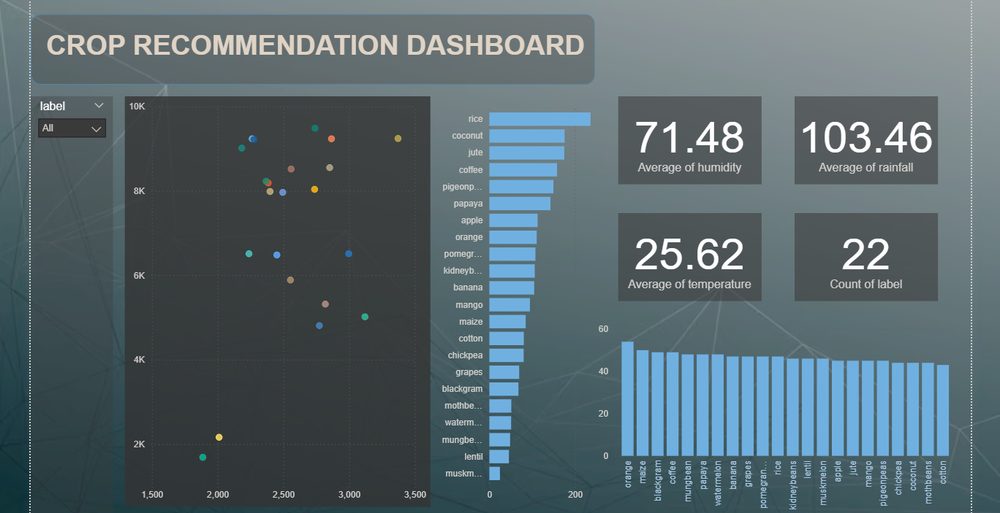

# Crop Recommendation Dashboard - Power BI

## Introduction
This Power BI dashboard helps farmers and agricultural experts identify optimal crops based on soil conditions and climate factors. Using the [Crop Recommendation Dataset](https://www.kaggle.com/datasets/atharvaingle/crop-recommendation-dataset) from Kaggle, it analyzes key parameters to provide actionable insights for crop planning.

## Key Features
- **Crop Suitability Analysis**: Recommends crops based on soil and weather conditions
- **Environmental Insights**: Visualizes temperature, humidity, and rainfall patterns
- **Soil Nutrient Tracking**: Monitors NPK (Nitrogen, Phosphorus, Potassium) levels
- **Interactive Filters**: Customize recommendations for specific conditions

## Data Source
**Dataset**: Crop_recommendation.csv from Kaggle  
**Parameters**:
- Soil nutrients (N, P, K)
- Temperature (°C)
- Humidity (%)
- pH level
- Rainfall (mm)
- Crop label (22 unique crops)

## Dashboard Components
| Visual | Purpose |
|--------|---------|
| **KPI Cards** | Shows average temperature, humidity, rainfall, and crop count |
| **NPK Analysis** | Compares nutrient levels across different crops |
| **pH Distribution** | Visualizes optimal pH ranges for each crop |
| **Scatter Plot** | Shows temperature vs. humidity crop clusters |
| **Slicers** | Filter by crop type, pH range, rainfall, and temperature |

## Key Insights
1. Different crops have specific NPK requirements
2. Temperature and humidity combinations create distinct crop clusters
3. Most crops thrive in neutral pH (6.0-7.5) range
4. Rainfall requirements vary significantly between crops
5. Rice requires highest nitrogen levels while grapes need more potassium

## How to Use
1. Adjust environmental parameters using slicers
2. Identify suitable crops in the recommendation panel
3. Compare nutrient requirements across crops
4. Analyze climate patterns for specific crops
5. Use filters to explore regional variations

## Requirements
- Power BI Desktop
- [Crop Recommendation Dataset](https://www.kaggle.com/datasets/atharvaingle/crop-recommendation-dataset)

[Download Dataset](https://www.kaggle.com/datasets/atharvaingle/crop-recommendation-dataset) | 
[Power BI Dashboard](Crop_Recommendation_Dashboard.pbix)

---

*Replace dashboard_preview.png with your screenshot and Crop_Recommendation_Dashboard.pbix with your Power BI file*
